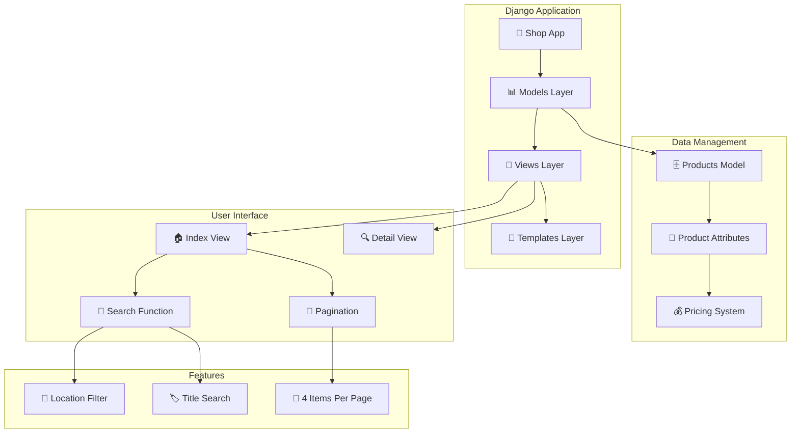

# 🛒 Django E-commerce Shop Application

[](https://djangoproject.com)
[](https://python.org)
[](https://en.wikipedia.org/wiki/E-commerce)

> A Django-based e-commerce shop application featuring product catalog management, search functionality, and pagination. Built with Django's robust framework to provide a scalable foundation for online retail operations.

## 🚀 Features

- ✅ **Product Management** - Complete product catalog with details
- ✅ **Search Functionality** - Search by product title and location
- ✅ **Pagination System** - Organized product display (4 items per page)
- ✅ **Product Details** - Individual product detail pages
- ✅ **Category Organization** - Product categorization system
- ✅ **Pricing Management** - Support for regular and discount pricing
- ✅ **Location-based Products** - Location-specific product filtering
- ✅ **Image Support** - Product image integration

## 🌟 Overview

This Django application provides the foundation for an e-commerce shop system. The application includes a comprehensive product management system with search capabilities and pagination for better user experience. Products can be organized by categories, locations, and pricing tiers, making it suitable for various retail scenarios.

## 🏗️ Application Architecture



## 📂 Project Structure

```
ecomsite/
├── shop/
│   ├── apps.py          # Django app configuration
│   ├── models.py        # Product data model
│   ├── views.py         # Application views and logic
│   └── tests.py         # Test cases (placeholder)
└── templates/
    └── shop/
        ├── index.html   # Product listing page
        └── detail.html  # Product detail page
```

## 🗄️ Data Model

### Products Model

The application uses a single `Products` model with the following fields:

```python
class Products(models.Model):
    title = models.CharField(max_length=200)           # Product name
    price = models.FloatField()                        # Regular price
    discount_price = models.FloatField()               # Discounted price
    category = models.CharField(max_length=200)        # Product category
    description = models.TextField()                   # Product description
    location = models.CharField(max_length=100, default='VIT')  # Product location
    image = models.CharField(max_length=300)           # Image URL/path
```

### Model Features

- **String Representation**: Products display their title when printed
- **Flexible Pricing**: Support for both regular and discount pricing
- **Categorization**: Products can be organized by category
- **Location-based**: Default location set to 'VIT'
- **Image Integration**: Support for product images via URL/path

## 🔧 Application Configuration

### App Configuration (`apps.py`)

```python
class ShopConfig(AppConfig):
    default_auto_field = 'django.db.models.BigAutoField'
    name = 'shop'
```

- Uses BigAutoField for primary keys
- App name: 'shop'

## 👀 Views and Functionality

### Index View

**URL Pattern**: `/` (root)
**Template**: `shop/index.html`

**Features**:
- Displays all products from the database
- **Search Functionality**: 
  - Search by product title (`title__icontains`)
  - Search by location (`location__icontains`)
- **Pagination**: 4 products per page
- **Query Parameter**: `item_name` for search
- **Page Parameter**: `page` for pagination

```python
def index(request):
    product_objects = Products.objects.all()
    
    # Search implementation
    item_name = request.GET.get('item_name')
    if item_name:
        product_objects = product_objects.filter(
            title__icontains=item_name
        ) | product_objects.filter(
            location__icontains=item_name
        )
    
    # Pagination implementation
    paginator = Paginator(product_objects, 4)
    page = request.GET.get('page')
    product_objects = paginator.get_page(page)
    
    return render(request, 'shop/index.html', {'product_objects': product_objects})
```

### Detail View

**URL Pattern**: `/product/<id>/` 
**Template**: `shop/detail.html`

**Features**:
- Displays individual product details
- Retrieves product by ID
- Shows complete product information

```python
def detail(request, id):
    product_object = Products.objects.get(id=id)
    return render(request, 'shop/detail.html', {'product_object': product_object})
```

## 🔍 Search System

### Search Capabilities

- **Title Search**: Case-insensitive search through product titles
- **Location Search**: Find products by location
- **Combined Search**: Uses OR logic to search both title and location
- **Partial Matching**: Uses `icontains` for flexible matching

### Search Implementation

```python
# Search query processing
item_name = request.GET.get('item_name')
if item_name:
    product_objects = product_objects.filter(title__icontains=item_name) | \
                     product_objects.filter(location__icontains=item_name)
```

## 📄 Pagination System

### Pagination Features

- **Items Per Page**: 4 products displayed per page
- **Page Navigation**: Standard Django pagination
- **URL Parameters**: Uses `page` parameter for navigation
- **Seamless Integration**: Works with search functionality

### Pagination Implementation

```python
# Pagination setup
paginator = Paginator(product_objects, 4)
page = request.GET.get('page')
product_objects = paginator.get_page(page)
```

## 💻 Setup and Installation

### Prerequisites

- Python 3.8 or higher
- Django 4.0 or higher
- Database system (SQLite default)

### Installation Steps

1. **Clone the repository**
```bash
git clone <repository-url>
cd ecomsite
```

2. **Install Django**
```bash
pip install django
```

3. **Run migrations**
```bash
python manage.py makemigrations
python manage.py migrate
```

4. **Create superuser (optional)**
```bash
python manage.py createsuperuser
```

5. **Start development server**
```bash
python manage.py runserver
```

## 🔧 Usage

### Adding Products

Products can be added through:
- Django Admin interface
- Database management
- Custom management commands
- API endpoints (if implemented)

### Accessing the Application

- **Home Page**: `http://localhost:8000/` - Product listing with search and pagination
- **Product Detail**: `http://localhost:8000/product/<id>/` - Individual product details
- **Search**: `http://localhost:8000/?item_name=<search_term>` - Search products
- **Pagination**: `http://localhost:8000/?page=<page_number>` - Navigate pages

## 🔍 Template Context

### Index Template Context

```python
{
    'product_objects': paginated_products  # Paginated queryset with search results
}
```

### Detail Template Context

```python
{
    'product_object': single_product  # Individual product instance
}
```

## ⚡ Customization Options

### Adjusting Pagination

Change the number of items per page:
```python
paginator = Paginator(product_objects, 8)  # Change from 4 to 8 items
```

### Extending Search Fields

Add more searchable fields:
```python
product_objects.filter(
    title__icontains=item_name
) | product_objects.filter(
    location__icontains=item_name
) | product_objects.filter(
    category__icontains=item_name  # Add category search
)
```

### Default Location

Modify the default location:
```python
location = models.CharField(max_length=100, default='Your_Location')
```

## 🧪 Testing

The application includes basic test structure:
- `tests.py` file available for implementing test cases
- Django's built-in testing framework support
- Test database isolation

## 📝 Notes

- **Image Handling**: Currently uses CharField for image paths/URLs
- **Error Handling**: Basic implementation - consider adding try/catch blocks
- **Security**: Implement proper validation and security measures for production
- **Performance**: Consider adding database indexing for frequently searched fields

